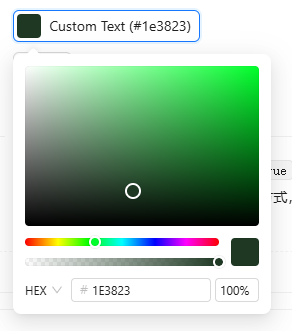
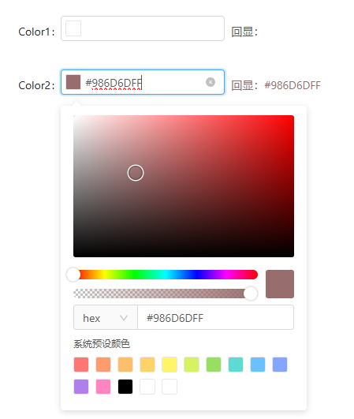

# antdv1.x-color-picker

[国内 Gitee 仓库](https://gitee.com/sudot/antdv1.x-color-picker) |
[全球 Gihub 仓库](https://github.com/sudot/antdv1.x-color-picker)

## 前言

ant-design-vue 的 UI 框架中，并没有 colorPicker 颜色选择器。找了一圈没有找到合适的支持 vue2 的颜色选择组件，最终找到了 [https://gitee.com/ghkeeping/ant-color-picker](https://gitee.com/ghkeeping/ant-color-picker)，并在其源码基础上修改后封装了该组件。

## 效果展示

[可以点击这里实时预览](https://sudot.net/antdv1.x-color-picker/)

| react 版 Antd 颜色选择器预览  | 本项目颜色选择器预览          |
| ----------------------------- | ----------------------------- |
|  |  |

## 修改记录

- 从原 vue3 版本的 ant-design-vue@2.x 降级为 vue2 版本的 ant-design-vue@1.x。
- 从 ts 转为 js。
- 调整选择器面板布局。
- 移除了透明度属性 `show-alpha`，保持为一直开启透明度。
- 移除了颜色滑动条和透明度条可自定义位置的属性，固定并不可配置，调整需要改源码。
- 添加了未支持的 `placement` 属性。
- 添加了面板中切换 `color-format` 功能。
- 添加了选择器外部输入框，并优化了外部和内部输入框的独立逻辑。

## 本地开发和运行

本项目是一个完整的工程项目，可以运行并预览实际效果。运行此项目按以下标准流程即可：

```
npm install
npm run serve
```

## 使用方法

1. 将 `src/components/color-picker` 整个目录拷贝至你项目中任意位置。
2. 在你的要使用此组件的页面中，引入 `src/components/color-picker/index.vue` 即可。

```html
<template>
  <color-picker v-model="color" />
</template>

<script>
  import ColorPicker from '@/components/color-picker';

  export default {
    components: { ColorPicker },
    data() {
      return {
        color: '#ff0000',
      };
    },
  };
</script>
```

### 属性

| 参数          | 说明                    | 类型   | 可选值                                                                                                                        | 默认值      |
| ------------- | ----------------------- | ------ | ----------------------------------------------------------------------------------------------------------------------------- | ----------- |
| value/v-model | 绑定值                  | string | —                                                                                                                             | —           |
| size          | 尺寸                    | string | large/default/small                                                                                                           | default     |
| color-format  | 写入 v-model 的颜色格式 | string | hsl/hsv/hex/rgb                                                                                                               | rgb         |
| predefine     | 预定义颜色              | array  | —                                                                                                                             | —           |
| placement     | 颜色选择器弹出位置      | string | `top` `left` `right` `bottom` `topLeft` `topRight` `bottomLeft` `bottomRight` `leftTop` `leftBottom` `rightTop` `rightBottom` | bottomRight |

### 事件

| 事件名称 | 说明               | 回调参数 |
| -------- | ------------------ | -------- |
| change   | 当绑定值变化时触发 | 当前值   |
